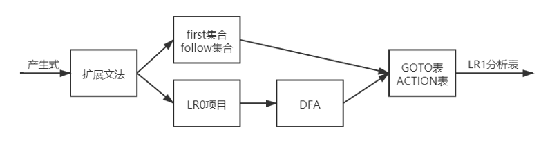
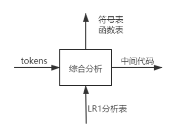

# C-Compiler-Project

## 1 Requirements Analysis

### 1.1 Function

- Conduct lexical and syntax analysis, outputting First sets, Follow sets, Action table, Goto table, LR1 parsing table, and code parsing process, saving them as files
- Include symbol table and function table, capable of generating intermediate code
- Generate assembly code based on the generated intermediate code using register selection algorithms
- Support for arrays and function calls in source code

### 1.2 Input & Output Example

#### 1.2.1 Input

```c
int program(int a,int b,int c)
{
    int i;
    int j;
    i=0;
    if(a>(b+c))
    {
        j=a+(b*c+1);
    }
    else
    {
        j=a;
    }
    while(i<=100)
    {
        i=j*2;
        j=j+1;
    }
    return i;
}
int demo(int a)
{
    a=a+2;
    return a*2;
}
void main(void)
{
    int a[2][2];
    a[0][0]=3;
    a[0][1]=a[0][0]+1;
    a[1][0]=a[0][0]+a[0][1];
    a[1][1]=program(a[0][0],a[0][1],demo(a[1][0]));
    return;
}
```

#### 1.2.2 Output

```assembly
.data

.text
    addiu $sp, $zero, 0x10018000
    or $fp, $sp, $zero
    jal  main
    jal  programEnd

f1:
    lw $7, 0($fp)
    lw $8, 4($fp)
    lw $9, 8($fp)
    sub $fp,$fp,12
    add $10,$zero,0
    add $11,$8,$9
    sgt $12,$7,$11
    bgt $12,$zero,l1
    j l2
l1:
    mul $13,$8,$9
    add $14,$13,1
    add $15,$7,$14
    add $16,$zero,$15
    j l3
l2:
    add $16,$zero,$7
l3:
l6:
    add $a2,$zero,100
    sgt $17,$10,$a2
    xori $17,$17,1
    bgt $17,$zero,l4
    j l5
l4:
    add $a2,$zero,2
    mul $18,$16,$a2
    add $10,$zero,$18
    add $19,$16,1
    add $16,$zero,$19
j l6
l5:
    add $v0,$zero,$10
    jr $ra

f2:
    lw $20, 0($fp)
    sub $fp,$fp,4
    add $21,$20,2
    add $20,$zero,$21
    add $a2,$zero,2
    mul $22,$20,$a2
    add $v0,$zero,$22
    jr $ra
main:
    add $23,$zero,3
    add $24,$zero,4
    add $25,$zero,2
    sub $sp,$sp,4
    sw $ra, 0($sp)
    sub $sp,$sp,4
    sw $ra, 0($sp)
    add $fp,$fp,4
    sw $25, 0($fp)
    jal  f2
    lw $ra, 0($sp)
    add $sp,$sp,4
    add $7,$zero,$v0
    add $fp,$fp,12
    sw $23, 0($fp)
    sw $24, 4($fp)
    sw $7, 8($fp)
    jal  f1
    lw $ra, 0($sp)
    add $sp,$sp,4
    add $8,$zero,$v0
    add $23,$zero,$8
    jr $ra

programEnd:
    nop

```

## 2 Outline Design

### 2.1 Task Breakdown

Based on the requirements analysis, the compiler should be divided into the following modules:

1. Lexical Analyzer
2. Syntax Analyzer
3. Semantic Analyzer
4. Intermediate Code Generator
5. Assembly Code Generator
6. Graphical User Interface Module  

### 2.2 Data Structure Design

#### 2.2.1 Lexical Analyzer

Lexical analysis is the first step in the processing pipeline. It sequentially scans the characters in the source file, matching them with a finite automaton corresponding to lexical tokens. This process generates various lexical tokens such as identifiers, keywords, constants, as well as operators, commas, semicolons, and other delimiters.


#### 2.2.2 Syntax Analyzer

Its main function is to obtain the LR1 parsing table. This syntax analyzer processes the input productions, first transforming the grammar into an augmented grammar S'. It then utilizes the augmented grammar to generate the First set and Follow set, concurrently generating LR0 item sets. By computing the closure of the item sets, it generates a DFA, obtaining the GOTO table and ACTION table. This process results in obtaining the LR1 parsing table.



#### 2.2.3 Semantic Analyzer

Perform semantic analysis based on the token stream and LR1 parsing table. During the semantic analysis with a single scan, it is necessary to generate a syntax tree where nodes are endowed with different attributes. Throughout the semantic analysis process, the variable table and function table need to be continually used and updated. Guided by semantic rules and LR1 parsing table, reduce the token stream to obtain intermediate code.

 

#### 2.2.3 Assembly Code Generator 

After obtaining the intermediate code, it can be translated into MIPS instructions, where register allocation is performed based on the register allocation algorithm.

## 3 Detailed Design

### 3.1 Lexical Analyzer

#### 3.1.1 Source Code Preprocessing

The implementation of the lexical analyzer relies primarily on the regular expression library `re` provided in Python to match token characters. For the source code file, the first step is to remove comments from the source code file, primarily achieved by using the function `findall`.

```python
def removeAnnotation(self, codes):  # 移除源代码中的注释
    annotation = re.findall('//.*?\n', codes, flags=re.DOTALL)  # .*?非贪婪
    if len(annotation) > 0:
        codes = codes.replace(annotation[0], "")  # 将注释替换成空白
    annotation = re.findall('/\*.*?\*/', codes, flags=re.DOTALL)
    if len(annotation) > 0:
        codes = codes.replace(annotation[0], "")
    ret = codes.strip()
    return ret

```

#### 3.1.2 Token Recognition

For recognizing syntax words in the preprocessed source code, a finite automaton is needed. Similarly, the `findall` function in the `re` library of Python can be used to identify all matching syntax words. 

Firstly, it is necessary to define regular expressions for potential syntax words. Define four regular expressions for syntax words that may appear in the source code: delimiters, operators, identifiers, and integers.

```python
self.regexs = [
    '\{|\}|\[|\]|\(|\)|,|;'  # 界符
    , '\+|-|\*|/|==|!=|>=|<=|>|<|='  # 操作符
    , '[a-zA-Z][a-zA-Z0-9]*'  # 标识符
    , '\d+'  # 整数
]

```

The words obtained through regular expression matching are classified based on their categories. The classification includes filling in the category of the word, the value of the word, and the position of the word in the source code file.

### 3.2 Syntax Analyzer

#### 3.2.1 First Set

LR1 algorithm requires the FIRST set for every left-hand side of the production. To obtain the FIRST set for all non-terminals, the algorithm for calculating the FIRST set for a single non-terminal (NT) is as follows:

Apply the following rules until the FIRST set for every non-terminal no longer increases:

1. If X is a terminal, then FIRST(X) = {X}.
2. If X is a non-terminal and has a production X → a…, add a to FIRST(X). If there is a production S → ε, add ε to FIRST(X).
3. If X → Y… is a production where Y is a non-terminal, add all non-empty elements from FIRST(Y) to FIRST(X). If X → Y1, Y2, …, Yk is a production, and Y<sub>1</sub>, Y<sub>2</sub>, …, Y<sub>i-1</sub> are all non-terminals, and for any 1 <= j <= i-1, FIRST(Y<sub>j</sub>) contains ε, then add all non-ε elements from FIRST(Y<sub>i</sub>) to FIRST(X). In particular, if all FIRST(Y<sub>j</sub>) for j = 1, 2, …, k contain ε, add ε to FIRST(X).

```python
def calNTFirstSet(self, symbol):
    eps = {'class': 'T', 'name': '', 'type': self.Epsilon}
    hasEpsAllBefore = -1  # 前面的非终结符是否全都能推出eps
    prods = [prod for prod in self.prods if prod.left == symbol]  # 左边符合条件的产生式
    if len(prods) == 0:
        return

    is_add = 1
    while is_add:
        is_add = 0
        for prod in prods:  # 遍历符合的产生式
            hasEpsAllBefore = 0

            for right in prod.right:  # 遍历产生式右边的每个符号
                # 2. 若X∈VN，且有产生式X->a…，a∈VT，则 a∈FIRST(X)
                #    X->ε,则ε∈FIRST(X)
                if right['class'] == 'T' or (right['type'] == self.Epsilon and len(prod.right) == 1):  # A->epsilon
                    # 有就加
                    if right['type'] not in self.firstSet[symbol]:
                        self.firstSet[symbol].append(right['type'])
                        is_add = 1
                    break

                # 3. 对NT, 之前已算出来过, 但有可能是算到一半的
                if len(self.firstSet[right['type']]) == 0:
                    if right['type'] != symbol:  # 防止陷入死循环
                        self.calNTFirstSet(right['type'])  # 先算NT自己的first集

                # X->Y…是一个产生式且Y ∈VN  则把FIRST(Y)中的所有非空符号串ε元素都加入到FIRST(X)中。
                if self.Epsilon in self.firstSet[right['type']]:
                    hasEpsAllBefore = 1

                for f in self.firstSet[right['type']]:
                    if f != self.Epsilon and f not in self.firstSet[symbol]:
                        self.firstSet[symbol].append(f)
                        is_add = 1

            # 到这里说明整个产生式已遍历完毕 看是否有始终能推出eps
            # 中途不能推出eps的已经break了   (例如Ba还是会来到这里，加e可能会有问题)
            # 所有right(即Yi) 能够推导出ε,(i=1,2,…n)，则
            if hasEpsAllBefore == 1:
                if self.Epsilon not in self.firstSet[symbol]:
                    self.firstSet[symbol].append(self.Epsilon)
                    is_add = 1

    return
```

After calculating the first set for a single non-terminal (NT), you can use these results to compute the first set for all terminals (T) and non-terminals (NT).

After calculating the first set for all terminals (T) and non-terminals (NT), you can use this result to compute the first set for a string, which is the ultimate goal.

#### 3.3.2 LR0 items

Before constructing the DFA, it is necessary to add a dot to the productions to transform them into LR0 item sets. Adding a dot to a production is essentially indicating the position of the dot on the right-hand side of the production.

#### 3.3.3 closure of LR1 item sets

The construction of the closure of LR1 item sets is crucial for generating the DFA. The algorithm for computing the closure is as follows:

1. Any item in I belongs to CLOSURE(I).
2. If A → α⋅Bβ belongs to CLOSURE(I), then B → ⋅γ also belongs to CLOSURE(I). Repeat the above steps until CLOSURE(I) no longer increases.

Loop through all productions and check each one. If the dot is at the end of a production, move to the next production. When there are non-terminals after the dot, compute the items for the non-terminals as if they were the left-hand side of the production, and add them to the closure. In other words, look for all productions of the form A → ⋅B and add them to the set. Repeat the process.

```python
def getLR1Closure(self, I):
    rst = []
    rst.extend(I)  # I项目自己肯定在闭包里

    # toString 已包含terms信息
    rstStr = [item.toString() for item in rst]  # 作为key值进行比对是否已有了
    while True:
        isAddItem = 0
        for item in rst:
            right = item.right  # 引用 为了缩短变量长度

            for i in range(len(right) + 1):
                if item.dotPos == len(right):  # 产生式的dot在最后面
                    continue
                if right[item.dotPos]['class'] == 'T':
                    continue
                tempRst = self.extendItem(item)  # 求包含item的闭包里的其他项目
                for i in tempRst:  # i可能会重复定义
                    tempStr = i.toString()
                    if tempStr not in rstStr:
                        rstStr.append(tempStr)
                        rst.append(i)  # tempRst已经求出闭包里的所有项目，但它是字符串，仅仅是为了方便比对，我们需要的还是rst
                        isAddItem = 1
        if isAddItem == 0:
            break

    return rst

```

#### **3.3.4** DFA
